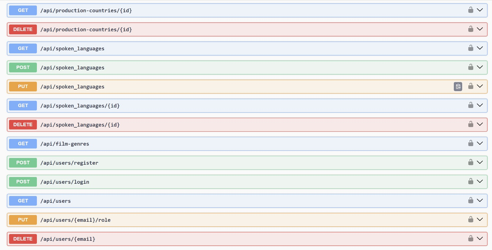
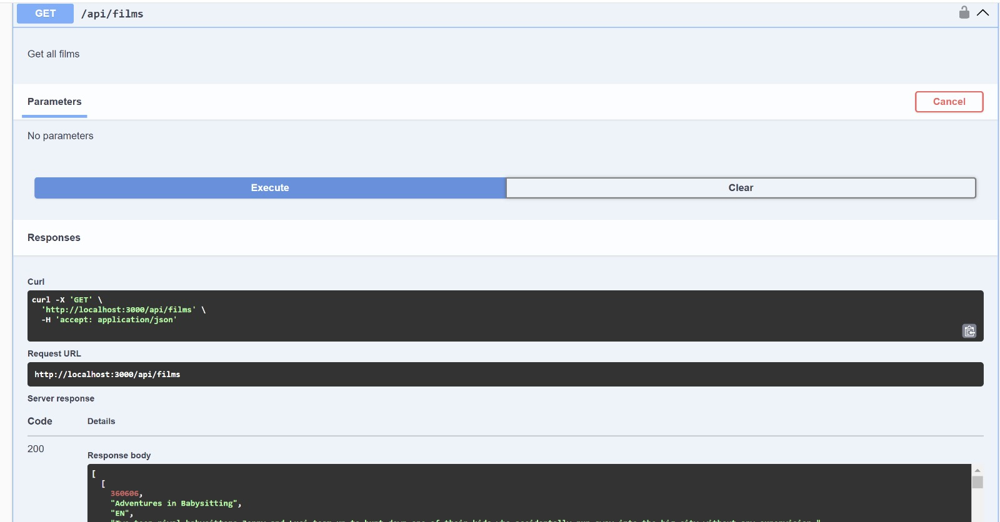
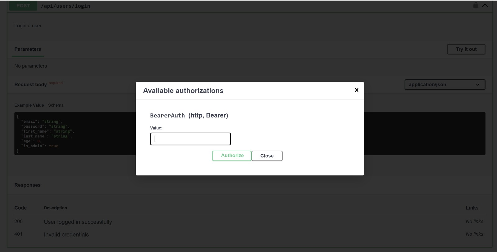

# App Backend

## Description
The backend of the Cinevision project provides a REST API for managing movies, genres, production companies, users, and more. Built with **Node.js**, **Express**, and **Sequelize**, it connects to a relational database (we used Oracle in our case). API documentation is generated using Swagger.

## Main Features
- RESTful API for CRUD operations.
- Swagger documentation available at `/swagger-ui`.
- Database integration with automatic table creation and synchronization.
- User-friendly error handling and robust data validation.

## Setup
1. **Install dependencies**: Run `npm install` in the backend directory.
2. **Set up environment variables**: Create a `.env` file to configure database access.
3. **Initialize the database**: Use `node sync-database.js` to set up tables.

## How It Works
- **Run the server**: `npm start` to launch the backend. Access the API at `http://localhost:3000`. ("Doesn't work in our case)
- **Swagger**: Explore the API endpoints via the Swagger interface at `/swagger-ui`.

## Screenshots

### API Endpoints Overview

### Get All Films API Endpoint

### Bearer Token Authorization

## What We Implemented
- Designed an API to handle films, genres, production companies, and users.
- Added Swagger for automatic API documentation.
- Used Sequelize to simplify database operations and synchronize models.
- Focused on clean, maintainable, and well-structured code.

---

This backend supports all required functionalities and is ready for deployment. 

