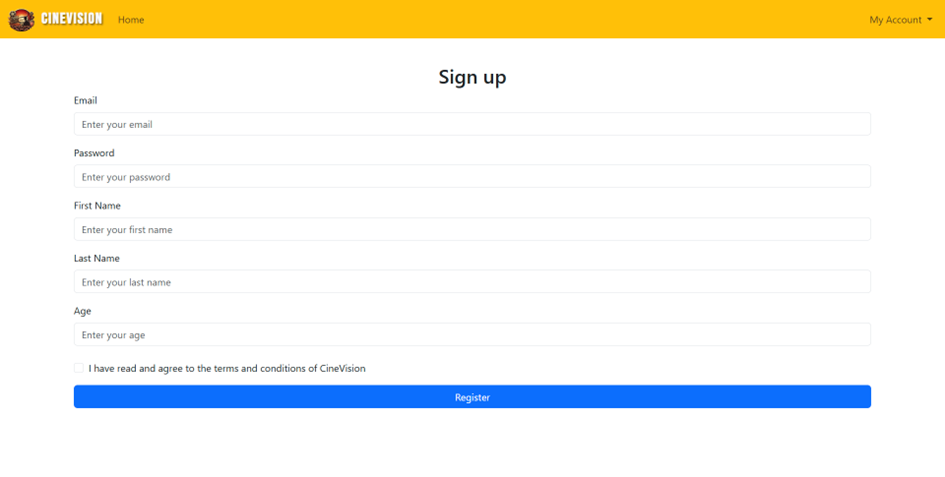
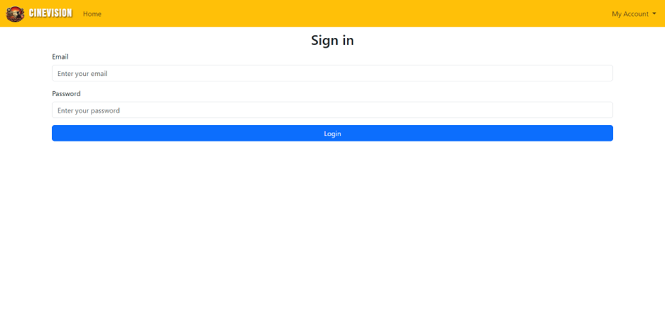
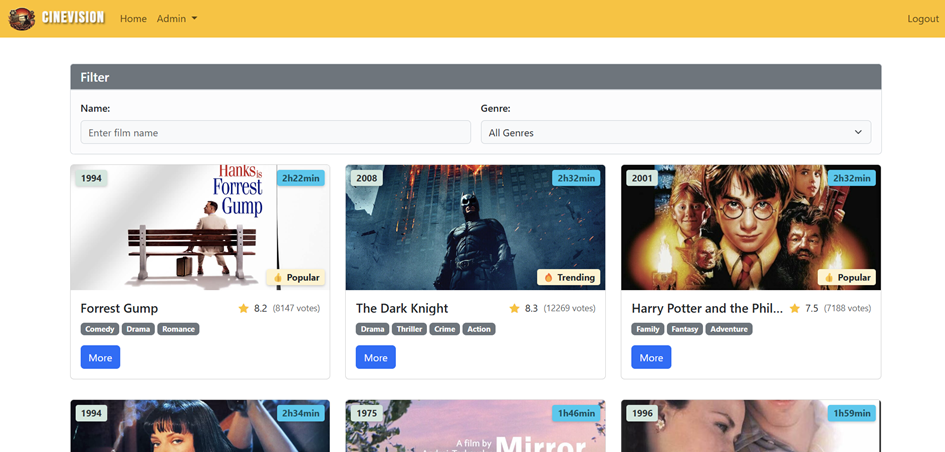
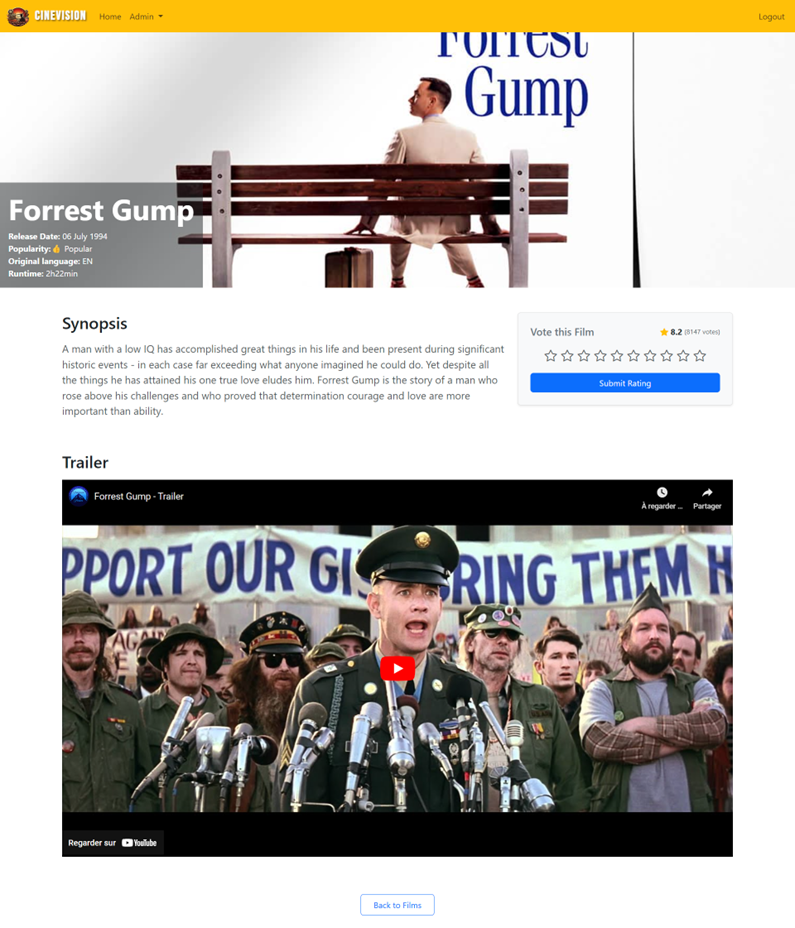
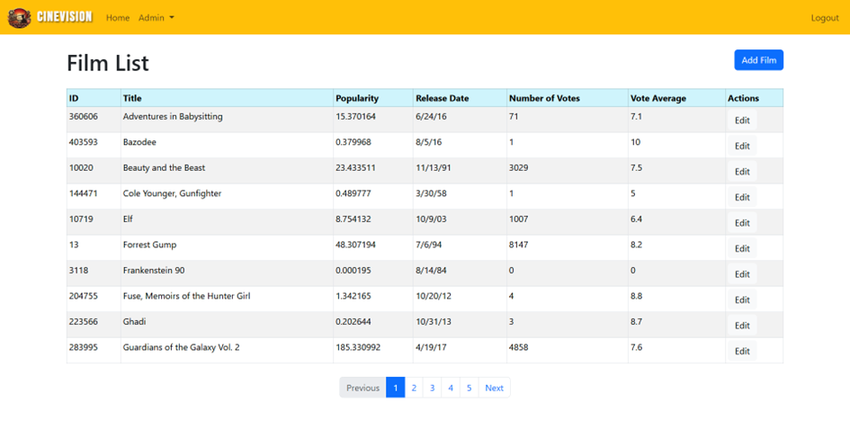
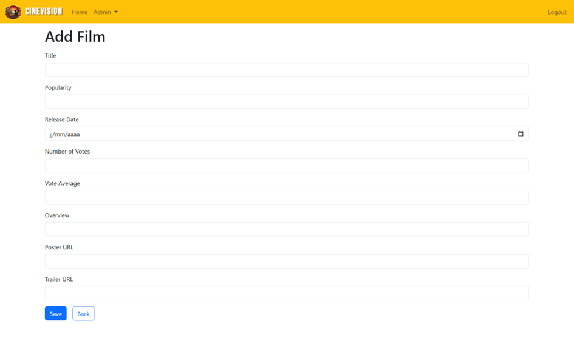
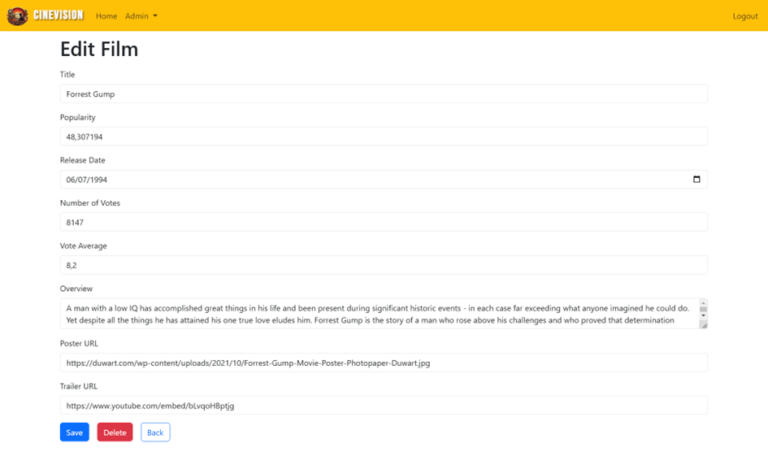

# App Frontend

This project is the frontend part of a web application designed to manage and display information about movies. The project was built using Angular and TypeScript, leveraging responsive design principles with Bootstrap.

## Project Structure

- **src/app**: Main directory containing the application modules and components.
  - **Admin**: Components for administrative functionalities.
  - **Film**: Modules and components to manage movies, genres, production countries, and production companies.
  - **Login and Register and Guards**: Modules for user authentication and registration.

## Features

### 1. **User Roles**
The application supports two types of user roles:

#### **Admin**
- Can perform CRUD operations on:
  - **Films**
  - **Genres**
  - **Production Countries**
  - **Production Companies**
- Has access to all the functionalities available to normal users.

#### **Normal User**
- Can:
  - **View the list of movies** with an overview.
  - **Filter movies** by:
    - Title (partial or complete match).
    - Genre (selected from a dropdown).
  - **View detailed information** about a selected movie, including additional characteristics.
  - **Rate a movie** (out of 10), which updates the database with their rating.

---

### 2. **User Authentication**
- **Registration**:
  - Component: `register.component.ts`
  - Allows new users to create an account.
- **Login**:
  - Component: `login.component.ts`
  - Enables users to log in to access their respective functionalities based on their role.

---

### 3. **Frontend Libraries**
- **Bootstrap**: Used extensively for creating a responsive and visually appealing UI.
- **Angular Forms**: Utilized for handling form validations and input bindings.

---

### 4. **Localization**
- Supports multi-language functionality using Angular’s localization features.

---

## Getting Started

### Prerequisites
- **Angular CLI**: Ensure Angular CLI is installed by running:
  ```bash
  npm install -g @angular/cli
  ```
- **Node.js**: Install Node.js

---

## Here are some screencshots of the application :


## Registration page


## Authentification page


## The page for viewing all films


## The page for viewing a particular film 


## The page for all table-related actions


## Add Film


## The page for editing or deleting a film


## Project Highlights

1. **Role-based Functionality**:
  - Admins can manage all entities (movies, genres, production countries, and companies).
  - Normal users can explore and interact with movies.

2. **Dynamic Movie Filtering**:
  - Users can filter movies by title or genre using intuitive UI elements.

3. **Interactive Movie Rating**:
  - Users can rate movies on a scale of 1 to 10, updating the backend in real-time.

4. **Responsive Design**:
  - The application is fully responsive and adapts seamlessly to all screen sizes, providing a consistent user experience.

5. **Scalable Architecture**:
  - Modular design with separate components for authentication, movie management, and user interaction.

---

### Future Enhancements
- Integration of user reviews alongside ratings.
- Advanced movie filtering options (e.g., release year, popularity).
- Improved localization support with more languages.

---
